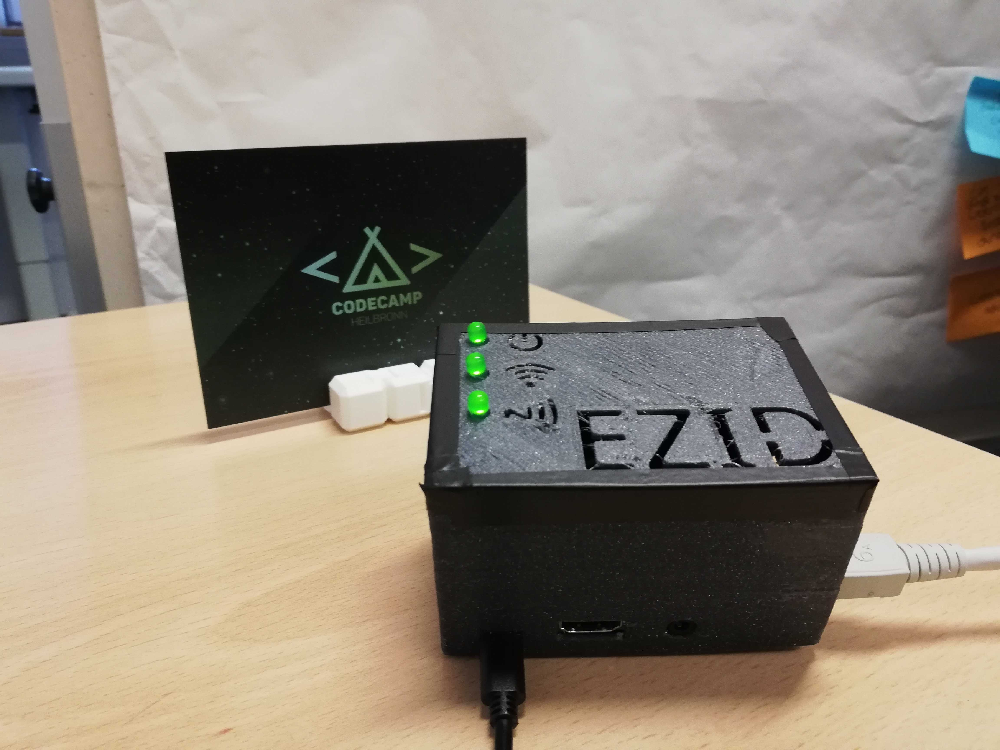

# ezid
RFID reader

`Problem Statement`

Numerous suppliers supply Lidl and Kaufland with their products. Large suppliers are connected to our tracking system, which enables the tracking of the delivery. However, small suppliers without their own IT departments do not have the necessary infrastructure to use our system and read data from passive RFID technology and send it over the network.
Your challenge: Find a way to realize self-sufficient, cost-effective readers in order to generate the best possible reading data based on passive RFID technology.

`Hardware Provided`

1. RFID reader - https://www.sick.com/us/en/identification-solutions/rfid/rfu62x/c/g285253
2. Label containing RFID chip(Diotough) - https://www.inotec.de/loesungen/barcode/besondere-belastung/
3. Raspberry pi 4 (4 GB) - https://www.raspberrypi.org/
4. LAN cables connecting RFID reader and Raspberry pi 4

`Current situation`

The scanner scans the packages provided by small suppliers (like a farmer) and saves it in a csv file using some existing infra. Later the data is transferred to the actual server using e-mail (with attached csv file)

`CONS of current situation`

Increased cost on scaling - Infra setup cost becomes high if this needs to duplicated at each site where small supplier is present
Manual intervention - as someone has to do an email
Hard to maintain - As farmer is not technically sound and Lidl/Kaufland can't provide a person at each site for maintenance in case something go wrong at supplier site. Currently if some issue happens like (device is offline or bad readings from readers) , the maintenance person near the main server (situated at big cities) ask the farmer(situated at small cities) to unplug-plug the device which is more like restart if something goes wrong. There is no way to know what when wrong.

`Our Solution`

A small setup which can be installed near RFID machine. This setup reads the data from reader and sends it to the cloud. In case if there is network issue, we have provided a lightweight disk-based database that is used for caching until network is up. 

More Technical -

Small setup is raspberry pi + process running inside
process running inside is a python daemon which pull data from reader
TCP IP protocol based requests - start scanning, get data, stop scanning (raspberry pi and RFID are connected through LAN cable)
python db api for caching data
mongo db client created in python to do CRUD operation with MONGO server (hosted by mongo atlas on GCP)
Node js API to pull data from mongo db cloud

`PROS of our Solution`

Low cost - Raspberry pie cost around($25) + free network provide Lidle(https://www.lidl.de/de/lidl-connect)
Automated - no manual intervention required for sending data
Possibility for Mongo DB charts(like geospatial ) and dashboard that can provide insights
